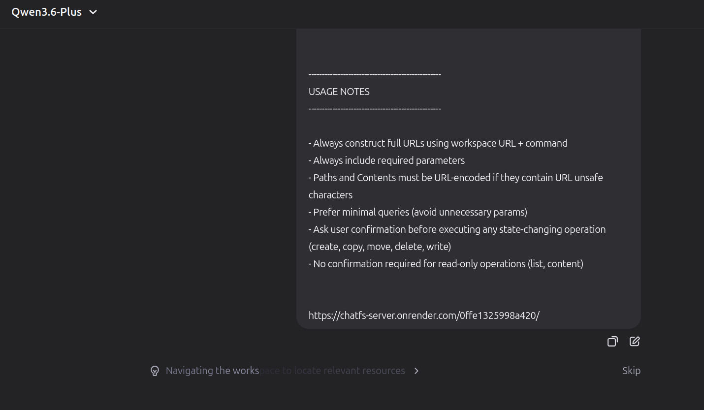
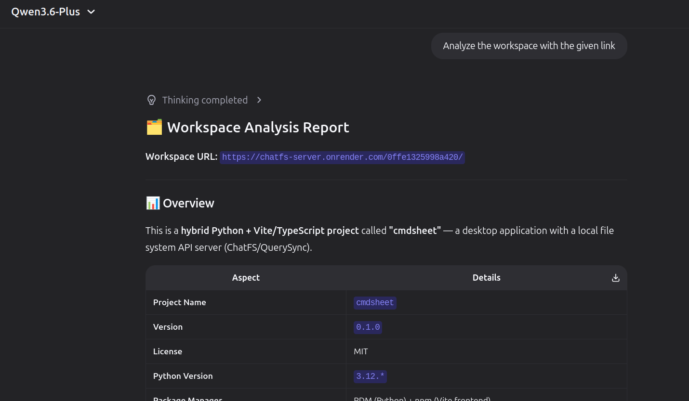
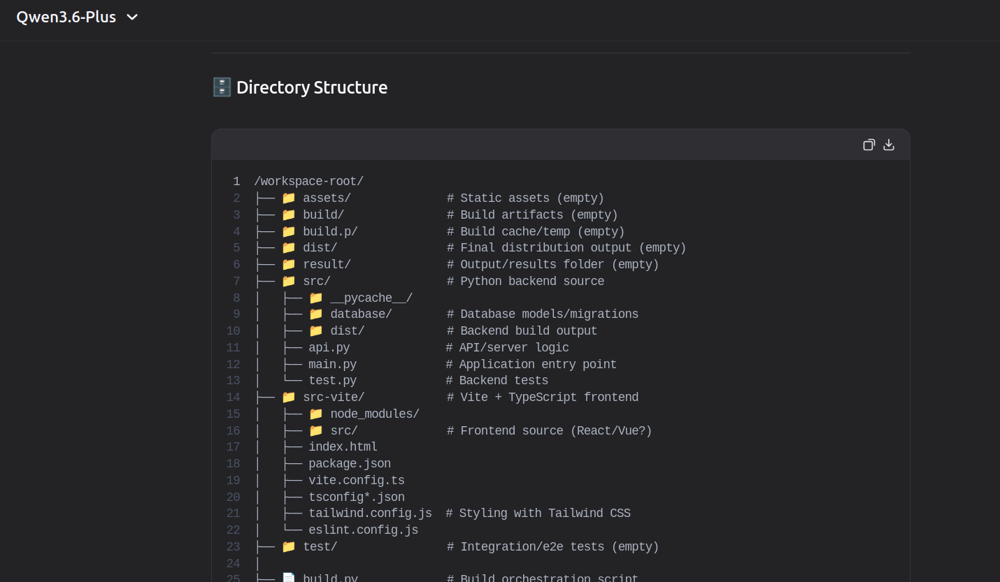
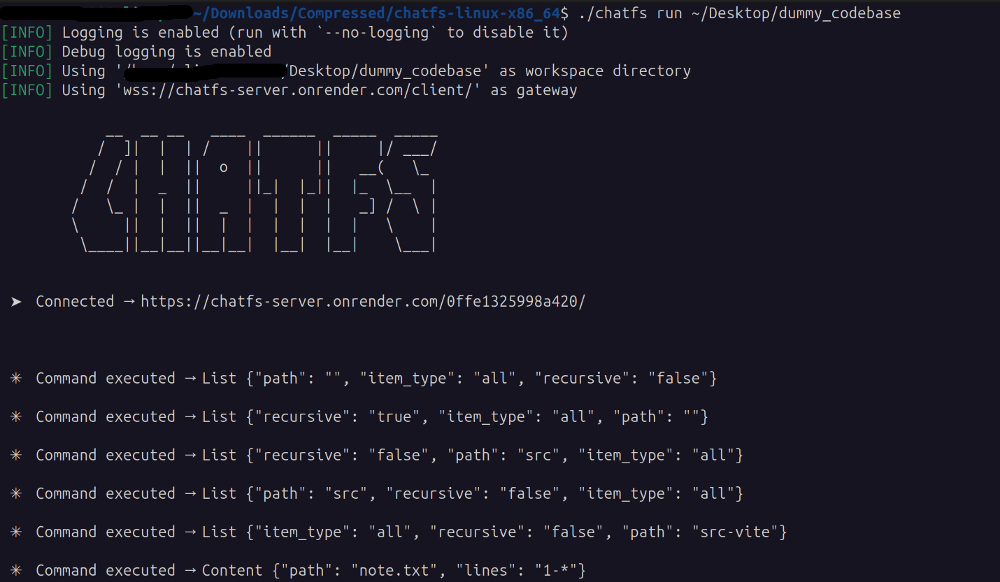

# **ChatFS: The Bridge That Lets Web AI Code Like a Local Pro**

## 1. Use case

Imagine you’re building something with Grok, Qwen, Claude, or ChatGPT in your browser.

At some point, the AI needs context from your actual codebase. You can't move to you AI IDE either, because everything you planned, your past chats won't be available there.

So you end up doing this annoying loop:

* copy a file
* paste it into chat
* ask for changes
* copy output back
* paste into editor
* repeat this like 20 times

It works… but it’s messy, especially when your codebase keeps changing.

What you *actually* want is simple:

> let the AI look at your real project and work with it directly

That’s what ChatFS is trying to fix.

---

## 2. What already exists

There are already some good tools out there, but each has its own catch:

* **MCP (Model Context Protocol)**: great idea, and works really well… but mostly inside desktop apps like Claude Desktop, Cursor, etc. Browser chats don’t really plug into it easily.

* **IDE agents (Cursor, Aider, Cline, Continue, etc.)**: super powerful, but locked inside your editor. If you're just chatting in a browser, you’re out of luck.

* **local bridges**: some people run local servers, but then you deal with ports, setup, auth, and still no clean browser integration.

* **upload-based tools**: fine for a few files, but breaks down fast for real projects.

So the gap is basically:

> web LLMs + real local filesystem = still kinda awkward

---

## 3. What ChatFS is

**ChatFS = a way for web AI to actually work with your local files without copy-paste hell.**

This leverages the modern **Web Browsing** feature available in almost every major AI provider.

It has two parts:

### 🌐 Cloud proxy ([ChatFS Gateway](https://github.com/deexor64/chatfs-server))

* hosted somewhere public
* acts like a simple router
* exposes clean URL-based commands the LLM can call

### 🦀 Local Rust client

* runs on your machine
* actually touches your filesystem
* enforces safety rules (path checks, ignore rules, etc.)
* talks to the cloud via WebSocket

You basically give the AI a session URL like:

```
https://server-name.com/5a0071207c90416/
```



From that point, it can:

* list files
* read content
* create/edit/move/delete stuff

just by generating normal URLs.




look at the [Prompt](./PROMPT.md) for more info

---

## 4. How it works (real flow)

1. You run the Rust client → it connects to the server
2. It registers itself with a client ID
3. You paste the workspace URL into chat
4. The AI wants context → it outputs a URL like:



see more info at [Installation Instructions](./INSTALLATION.md)

```
/list?path=&recursive=true
```

5. Server forwards it to your local client
6. Rust client executes it safely
7. Result comes back to the chat
8. AI continues working with real context

It feels like the AI is “browsing your repo”, but everything still stays controlled on your machine.

---

## 5. Architecture

### Server side

* Python + FastAPI
* very thin layer
* just forwards requests over WebSocket
* each workspace is isolated by a unique client ID

### Client side

* persistent WebSocket connection
* strong path validation (no escaping workspace)
* ignore rules (`.chatignore`)
* structured operations (list, content, create, move, etc.)
* config stored locally (`~/.config/chatfs`)

### Transport

* everything is URL-based right now (GET only)
* mainly because web LLMs are way more reliable with plain text URLs than structured tool calls
* WebSocket is used underneath for actual communication

---

## 6. What it can do right now

* list directories (recursive or not)
* read file content (with line ranges)
* create files/folders
* copy / move files
* delete files/folders
* write single-line edits (shift/replace)
* ignore rules support
* multiple session isolation

---

## 7. Known limitations (it’s still early)

* This is more of a hobby project than a professional tool (but it works)
* URL-based system is a bit hacky, but it works well enough for LLMs
* no reliable multiline content writes (becuase as of 2026 web LLMs can't do POST requests)
* no encryption yet between client and server (it’s still early, mostly local use anyway)
* still experimental — expect rough edges and bugs
* not really battle-tested yet, so don’t use it on anything critical 😅
* Due to safety features of some AI models, the tool may not work correctly. Only the good candiates were **Grok** and **Qwen** AI so far.

Generally safe unless you do something weird with the tool
Backward directory traversal via "../" is blocked for safety

---

## 8. Why this is different

Most tools assume you’re inside:

* an IDE
* or a special desktop app
* or a tightly controlled environment

ChatFS is more like:

> “just open a browser chat and let it talk to your local machine safely”

It tries to keep things simple:

* cloud proxy is just a dumb middleman
* Rust client does all the real work
* LLM just uses URLs like a remote control

---

⚠️ A quick note

This tool gives an AI controlled access to your local workspace, so use it responsibly.

I’m not responsible for anything that happens from misuse, accidental deletes, or weird prompts going wrong.

Basically — don’t connect it to anything important without understanding what it can do.

Operations like `list` and `content` are safe to try and most useful.

🔐 Privacy note

For better privacy, it’s recommended to self-host the server part instead of using a public one.

That way, your workspace traffic doesn’t go through any external server you don’t control.
